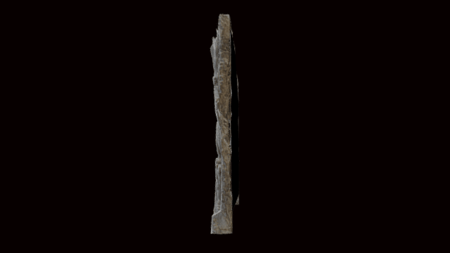

 

# A 3D model of the Amaravati Maya Relief

3D data for recreation of a British Museum object.

A drum slab carved in limestone with the four events related to the Buddha's birth: Māyādevī's Dream (top right); the Interpretation of the Dream attended by the dīkpāla-s (top left); the Birth of the Buddha attended again by the dīkpāla-s (bottom right); the Presentation of the Buddha to the caitya of the Śākyas (bottom left).

# LICENSE
The contents of this repository are licensed under CC-BY-NC-SA

# Credits
Photographs and models by Daniel Pett <dpett@britishmuseum.org>, Digital Humanities Lead, British Museum
Copyright Trustees of the British Museum
